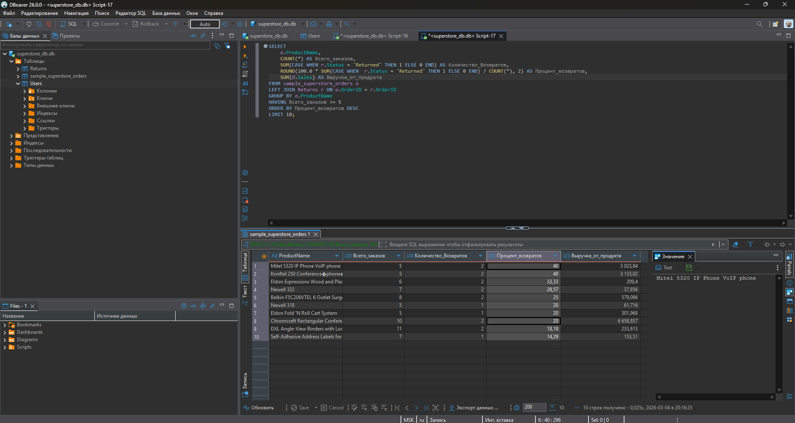
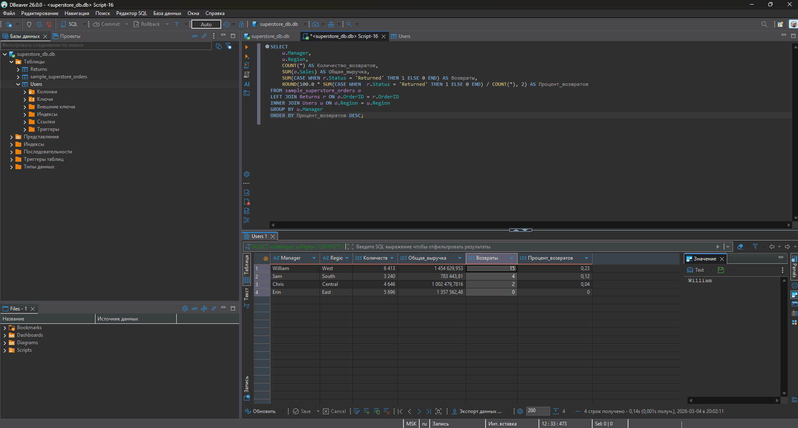

# Анализ продаж Superstore (SQL)

Портфолио junior Data Analyst  
Анализ учебного датасета Superstore с использованием SQL (SQLite + PostgreSQL)

## О проекте

- Датасет: Superstore (заказы, возвраты, менеджеры)
- Инструменты: DBeaver, SQLite, PostgreSQL
- Навыки: SELECT, WHERE, GROUP BY, JOIN (LEFT/INNER), CASE WHEN, агрегаты, проценты, анализ возвратов

## Основные запросы

1. Базовая фильтрация и группировка → `sql_queries/01_basic_select.sql`  
2. Возвраты по регионам → `sql_queries/03_joins_returns.sql`  
3. Эффективность менеджеров (выручка + % возвратов) → `sql_queries/04_manager_performance.sql`  
4. Самые проблемные продукты → `sql_queries/05_problem_products.sql`

## Ключевые выводы

- Лучший менеджер: **Erin (East)** — 0% возвратов при высокой выручке  
- Худший по возвратам: **William (West)** — 0,23% возвратов (15 случаев)  
- Самые проблемные продукты: Mitel 5320 IP Phone и Konftel 250 Conference phone (по 40% возвратов)

## Скриншоты результатов

.
.

## Как запустить

1. Установить DBeaver  
2. Подключить superstore.db (SQLite) или импортировать данные в PostgreSQL  
3. Выполнить файлы из папки sql_queries
